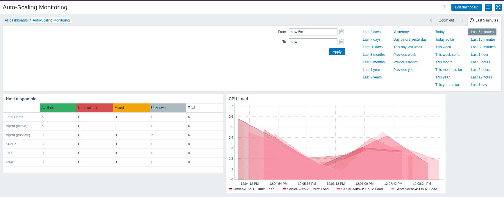

# TP Observabilité : Automatisation du monitoring avec Zabbix 7.0

Mise en place d'une infrastructure de monitoring auto-adaptative utilisant Zabbix et Docker. Le système détecte automatiquement les nouveaux serveurs (auto-scaling) et les intègre dans un dashboard dynamique.



---

## 1. Déploiement de l'infrastructure


**Docker Compose (Stack Serveur)**

Le fichier docker-compose.yml déploie le serveur Zabbix, une base de données PostgreSQL, l'interface Web (Nginx) et un agent local.

```bash
docker-compose up -d
```

**Note** : L'interface est accessible sur http://localhost:8080 (Admin / zabbix).

---

## 2. Configuration de l'Auto-Scaling (Auto-Registration)

Pour que les nouveaux serveurs soient ajoutés automatiquement, nous utilisons l'Active Agent Auto-Registration.

**Etapes de configuration dans l'interface :**

- Menu : Alerts > Actions > Autoregistration actions
- Action : Créer une règle nommée "Auto-Registration Linux"
- Condition : Host name contains Server-Auto
    - Opérations :
        - Add host : Crée l'objet dans l'inventaire
        - Add to host groups : Linux server
        - Link to templates : Linux by Zabbix agent active

&nbsp;
**Simulation d'un nouveau serveur :**

Pour simuler l'ajout d'une machine dans le cluster, on lance un conteneur agent avec des variables d'environnement spécifiques :
```bash
docker run -d --name agent-scaling-1 \
  --network <NOM_DU_RESEAU_DOCKER> \
  -e ZBX_HOSTNAME=Server-Auto-Test \
  -e ZBX_SERVER_ACTIVE=zabbix-server \
  zabbix/zabbix-agent:7.0-alpine-latest
```

---

## 3. Dashboard dynamique

**Configuration des Widgets :**
Add widget -> type Graph -> Name CPU Load
- Dataset : 
    - host patterns : ```Server-Auto-"```
    - item pattern : ```Linux Load Average```

Dès qu'un serveur finit son auto-registration :
- Il apparaît dans la liste du Host Navigator
- En cliquant dessus, le graphique CPU Load se met à jour instantanément pour afficher ses données propres.

---

## 4. Troubleshooting

Pour vérifier la communication entre un nouvel agent et le serveur :
```bash
docker logs agent-scaling-1
```
- ```active checks #1 started``` : connexion réussie
- ```host [Server-Auto-Test] not found``` : l'agent contacte le serveur mais l'action d'Auto-registration n'est pas encore active

